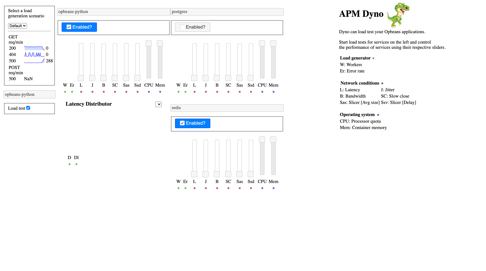
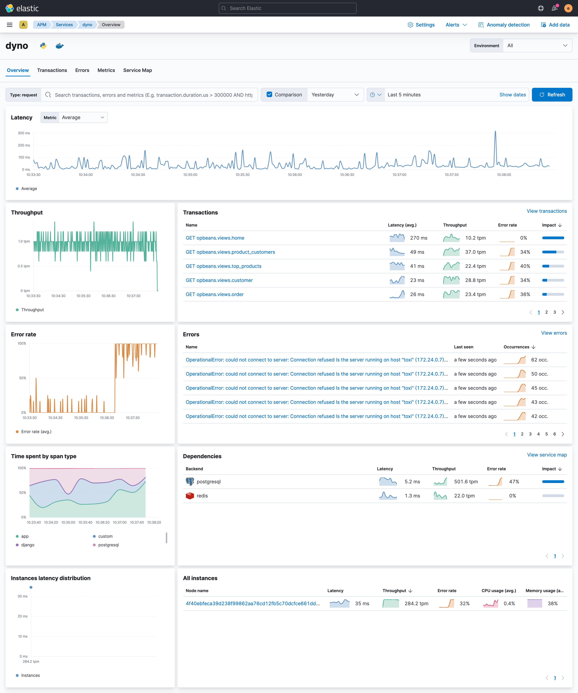

# APM Integration Testing

This repo contains tools for end-to-end (eg agent -> apm server -> elasticsearch <- kibana) development and testing of Elastic APM.

[](https://github.com/elastic/apm-integration-testing/actions/workflows/ci.yml)

## Prerequisites

The basic requirements for starting a local environment are:

- Docker
- Docker Compose
- Python (version 3 preferred)

This repo is tested with Python 3 but starting/stopping environments work with Python 2.7 is supported on a best-efforrt basis. To change the default `PYTHON` version you have to set `PYTHON` environment variable to something like `PYTHON=python2`.

### Docker

[Installation instructions](https://www.docker.com/community-edition)

### Docker compose
[Installation instructions](https://docs.docker.com/compose/install/)

### Python 3

- Windows: [Installation instructions](https://www.python.org/downloads/windows/)
- Mac (using [Homebrew](https://brew.sh/)):
  ```sh
  brew install python
  ```
- Debian/Ubuntu
  ```sh
  sudo apt-get install python3
  ```
## Running Local Enviroments

### Starting an Environment

`./scripts/compose.py` provides a handy CLI for starting a testing environment using `docker-compose`.
`make venv` creates a virtual environment with all of the python-based dependencies needed to run `./scripts/compose.py` - it requires `virtualenv` in your `PATH`.
Activate the virtualenv with `source venv/bin/activate` and use `./scripts/compose.py --help` for information on subcommands and arguments. Finally, you can execute the following command to list all available parameter to start the environment `./scripts/compose.py start --help`.

[APM LocalEnv Quickstart](QUICKSTART.md)

#### Logging in

By default, Security is enabled, which means you need to log into Kibana and/or authenticate with Elasticsearch.
An assortment of users is provided to test different scenarios:

 * `admin`
 * `apm_server_user`
 * `apm_user_ro`
 * `kibana_system_user`
 * `*_beat_user`

The password for all default users is `changeme`.

### Stopping an Environment

All services:
```
./scripts/compose.py stop

# OR

docker-compose down
```

All services and clean up volumes and networks:
```
make stop-env
```

Individual services:
```
docker-compose stop <service name>
```

## Example environments

We have a list with the most common flags combination that we internally use when developing our APM solution. You can find the list here:

|Persona | Flags | Motivation / Use Case | Team | Comments |
|--------|-------|-----------------------|------|----------|
| Demos & Screenshots	| `./scripts/compose.py start --release --with-opbeans-dotnet --with-opbeans-go --with-opbeans-java --opbeans-java-agent-branch=pr/588/head --force-build --with-opbeans-node --with-opbeans-python --with-opbeans-ruby --with-opbeans-rum --with-filebeat --with-metricbeat 7.3.0`	| demos, screenshots, ad hoc QA. It's also used to send heartbeat data to the cluster for Uptime | PMM	| Used for snapshots when close to a release, without the `--release` flag |
| Development | `./scripts/compose.py start 7.3 --bc --with-opbeans-python --opbeans-python-agent-local-repo=~/elastic/apm-agent-python` | Use current state of local agent repo with opbeans | APM Agents | |
| | `./scripts/compose.py start 7.3 --bc --start-opbeans-deps` | This flag would start all opbeans dependencies (postgres, redis, apm-server, ...), but not any opbeans instances | APM Agents | This would help when developing with a locally running opbeans. Currently, we start the environment with a `--with-opbeans-python` flag, then stop the opbeans-python container manually |
| Developer | `./scripts/compose.py start main --no-apm-server` | Only use Kibana + ES in desired version for testing | APM Server |  |
| Developer | `./scripts/compose.py start --release 7.3 --no-apm-server` | Use released Kibana + ES, with custom agent and server running on host, for developing new features that span agent and server. | APM Agents | If `--opbeans-go-agent-local-repo` worked, we might be inclined to use that instead of running custom apps on the host. Would have been handy while developing support for breakdown graphs. Even then, it's probably still faster to iterate on the agent without involving Docker. |
| Developer | `./scripts/compose.py start main --no-kibana` | Use newest ES/main, with custom kibana on host, for developing new features in kibana | APM |  |
| Developer | `./scripts/compose.py start 6.3 --with-kafka --with-zookeeper --apm-server-output=kafka --with-logstash --with-opbeans-python` | Testing with kafka and logstash ingestion methods | APM |  |
| Developer | `./scripts/compose.py start main --no-kibana --with-opbeans-node --with-opbeans-rum --with-opbeans-x` | Developing UI features locally | APM UI | |
| Developer | `./scripts/compose.py start main --docker-compose-path - --skip-download --no-kibana --with-opbeans-ruby --opbeans-ruby-agent-branch=main > docker-compose.yml` | Developing UI features againt specific configuration | APM UI | We sometimes explicity write a `docker-compose.yml` file and tinker with it until we get the desired configuration becore running `docker-compose up` |
| Developer | `scripts/compose.py start ${version}` | Manual testing of agent features | APM Agents | |
| Developer | `./scripts/compose.py start main --with-opbeans-java --opbeans-java-agent-branch=pr/588/head --apm-server-build https://github.com/elastic/apm-server.git@main` | Test with in-progress agent/server features | APM UI |  |
| Developer | `./scripts/compose.py start 7.0 --release --apm-server-version=6.8.0` | Upgrade/mixed version testing | APM | Then, without losing es data, upgrade/downgrade various components |
| Developer | `./scripts/compose.py start --with-opbeans-python --with-opbeans-python01 --dyno main` | Spin up a scenario for testing load-generation.  | APM | The management interface will be available at http://localhost:9000 |


### Change default ports

Expose Kibana on http://localhost:1234:

    ./scripts/compose.py start main --kibana-port 1234

### Opbeans

Opbeans are demo web applications that are instrumented with Elastic APM.
Start `opbeans-*` services and their dependencies along with apm-server, elasticsearch, and kibana:

    ./scripts/compose.py start --all main


This will also start the `opbeans-load-generator` service which, by default,
will generate random requests to all started backend Opbeans services.
To disable load generation for a specific service, use the `--no-opbeans-XYZ-loadgen` flag.

Opbeans RUM does not need a load generation service,
as it is itself generating load using a headless Chrome instance.

#### Start Opbeans with a specific agent branch

You can start Opbeans with an agent which is built from source from a specific branch or PR.
This is currently only supported with the Go and the Java agent.

Example which builds the https://github.com/elastic/apm-agent-java/pull/588 branch from source and uses an APM server built from main:

    ./scripts/compose.py start main --with-opbeans-java --opbeans-java-agent-branch=pr/588/head --apm-server-build https://github.com/elastic/apm-server.git@main

Note that it may take a while to build the agent from source.

Another example, which installs the [APM Python
Agent](https://github.com/elastic/apm-agent-python) from the `main` branch
for testing against [opbeans-python](https://github.com/elastic/opbeans-python)
(for example, for end to end log correlation testing):

    ./scripts/compose.py start main --with-opbeans-python --with-filebeat --opbeans-python-agent-branch=main --force-build

Note that we use `--opbeans-python-agent-branch` to define the Python agent
branch for opbeans-python, rather than `--python-agent-package`, which only
applies to the `--with-python-agent-*` flags for the small integration test
apps.


### Uploading Sourcemaps

The frontend app packaged with opbeans-node runs in a production build, which means the source code is minified. The APM server needs the corresponding sourcemap to unminify the code.

You can upload the sourcemap with this command:

    ./scripts/compose.py upload-sourcemap

In the standard setup, it will find the config options itself, but they can be overwritten. See

    ./scripts/compose.py upload-sourcemap --help

### Kafka output

    ./scripts/compose.py start --with-kafka --with-zookeeper --apm-server-output=kafka --with-logstash main

Logstash will be configured to ingest events from Kafka.

Topics are named according to service name. To view events for 1234_service-12a3:

    docker exec -it localtesting_6.3.0-SNAPSHOT_kafka kafka-console-consumer --bootstrap-server kafka:9092 --topic apm-1234_service-12a3 --from-beginning --max-messages 100

Onboarding events will go to the `apm` topic.

Note that index templates are not loaded automatically when using outputs other than Elasticsearch.  Create them manually with:

    ./scripts/compose.py load-dashboards

If data was inserted before this point (eg an opbeans service was started) you'll probably have to delete the auto-created `apm-*` indexes and let them be recreated.

## 🦖 Load testing in Dyno mode

The APM Integration Test Suite includes the ability to create an environment that is useful for modeling various scenarios where services are failed or experiencing
a variety of constraints, such as network, memory, or network pressure.

Starting the APM Integration Test suite with the ability to generate load and manipulate the performance characteristics of the individual chararteristics is called `Dyno Mode`.

To enable Dyno Mode, apped the `--dyno` flag to the arguments given to `./script/compose.py`. When this flag is passed, the test suite will start as it normally would, but various
additional components will be enabled which all the user to generate load for various services and to manipulate the performance of various components.

After starting in Dyno Mode, navigate to http://localhost:9000 in your browser. There, you should be presented with a page which shows the Opbeans which are running, along with
any dependent services, such as Postgres or Redis.

A pane on the left-hand side of the window allows load-generate to be started and stopped by clicking the checkbox for the Opbean(s) you wish to apply load to. Unchecking the box
for an Opbean in this pane will cause load-generation to cease.

After load generation is started, the number of requests can be adjusted by moving the `W` slider for the relevant Opbean up or down. To control the likelihood that a request will
result in an error in the application which can be seen in APM, use the `E` slider to adjust the error rate. Moving the slider up will result in a higher percentage of requests
being errors.

### Supported Dyno Opbeans

Not all Opbeans are supported for use with Dyno

|Opbean|Supported|
|------|---------|
|Python|:white_check_mark:|
|Go|:black_square_button:|
|.NET|:black_square_button:|
|Java|:black_square_button:|
|Node|:black_square_button:|
|Ruby|:black_square_button:|

### Using Dyno with a remote APM Server

It is possible to connect the infrastructure generated by compose.py to a remote APM Server.
This makes possible to send APM data from the scenarios modeled with Dyno.
The following command will launch Opbeans-python and Dyno locally,
the Opbeans-python is configured as the environment `local` of the service `dyno-service`,
and using the version name `test-demo`

```
APM_SERVER_URL=https://apm.example.com \
APM_TOKEN=MySuPerApMToKen \
python3 ./scripts/compose.py start 8.0.0 \
  --no-kibana \
  --no-elasticsearch \
  --dyno  \
  --apm-server-url "${APM_SERVER_URL}" \
  --apm-server-secret-token="${APM_TOKEN}" \
  --with-opbeans-python \
  --opbeans-python-service-environment local \
  --opbeans-node-service-version test-demo \
  --opbeans-python-service-name dyno-service
```

when the Docker container started you can connect to the Dyno UI at http://localhost:9000 and modify the scenario to cause errors,
in this case we have disabled PostgreSQL to cause a database service error.



Then we can check the result of our changes in Dyno in the APM UI, in this case we can see that
the error rate for postgreSQL is increasing.


### Introducing failure into the network

For each service, different classes of network failure can be introduced and adjusted with their respective sliders. They are as follows:

|Slider key|Slider name|Description|
|:--------:|:---------:|:----------|
| **L**    | Latency   | Adds latency to all data. The overall delay is equal to `latency` +/- `jitter`. |
| **J**    | Jitter    | Adds jitter to all data. The overall delay is equal to `latency` +/- `jitter`. |
| **B**    | Bandwidth | The overall amount of bandwidth available to the connection |
| **T**    | Timeout   | Stops all data from getting through, and closes the connection after timeout. If timeout is 0, the connection won't close, and data will be delayed until the timeout is increased.|
| **Sas**  | Packet slice average size | Slice TCP packets into this average size |
| **Ssd**  | Packet slice average delay | Introduce delay between the transmission of each packet |

### Modifying system properties

The container for each sevice may be instantly resized to the amount of available CPU power or total memory up or down through use of the CPU and Memory slider respectively.

### Enabling/disabling services

Unchecking the button immediately above the panel of sliders for each service will immediately cut off access to that service. The service itself will remain up but no traffic will be routed to it.
Re-checking the box will immediately restore the network connectivity for the service.

### Debugging problems
#### Load generation is on but no requests are arriving
Occasionally, all network routing will fail due to an unresolved bug with thread-safety in the proxy server. If you expect load-generation to be running but you do not see any traffic arriving at the Opbeans,
it is possibly that the network proxy has crashed. To quickly restore it, run `docker-compose restart toxi`. Traffic should be immediatley restored.

## Advanced topics

### Dumping docker-compose.yml

`./scripts/compose.py start main --docker-compose-path - --skip-download` will dump the generated `docker-compose.yml` to standard out (`-`) without starting any containers or downloading images.

Omit `--skip-download` to just download images.

### Testing compose

`compose.py` includes unittests, `make test-compose` to run.

### Jaeger

APM Server can work as a drop-in replacement for a Jaeger collector and ingest traces directly from a Jaeger agent via gRPC.

To test Jaeger/gRPC, start apm-integration-testing, run the Jaeger Agent, and start the Jaeger hotrod demo:

```
./scripts/compose.py start 7.13 \
--apm-server-secret-token="abc123"
```

```
docker run --rm -it --name jaeger-agent --network apm-integration-testing -p6831:6831/udp \
-e REPORTER_GRPC_HOST_PORT=apm-server:8200 \
-e AGENT_TAGS="elastic-apm-auth=Bearer abc123" \
jaegertracing/jaeger-agent:latest
```

```
docker run --rm -it --network apm-integration-testing \
-e JAEGER_AGENT_HOST=jaeger-agent \
-e JAEGER_AGENT_PORT=6831 \
-p8080-8083:8080-8083 jaegertracing/example-hotrod:latest all
```

Finally, navigate to http://localhost:8080/ and click around to generate data.

## Running Tests

Additional dependencies are required for running the integration tests:
- python3
- virtualenv

On a Mac with Homebrew:

```sh
brew install pyenv-virtualenv
```

All integration tests are written in python and live under `tests/`.

Several `make` targets exist to make their execution simpler:

- test-server
- test-kibana

These targets will create a python virtual environment in `venv` with all of the dependencies need to run the suite.

Each target requires a running test environment, providing an apm-server, elasticsearch, and others depending on the particular suite.

Tests should always eventually be run within a Docker container to ensure a consistent, repeatable environment for reporting.

Prefix any of the `test-` targets with `docker-` to run them in a container eg: `make docker-test-server`.

### Network issues diagnose

It is possible to diagnose network issues related with lost documents
between APM Agent, APM server, or Elasticsearch.

In order to do so, you have to add the `--with-packetbeat` argument
to your command line.

When you add this argument an additional Docker container running Packetbeat is
attached to the APM Server Docker container,
this container will grab information about the communication between APM Agent,
APM server, and Elasticsearch that you can analyze in case of failure.

When a test fails, data related to Packetbeat and APM is dumped
with [elasticdump](https://www.npmjs.com/package/elasticdump) into a couple
of files `/app/tests/results/data-NAME_OF_THE_TEST.json`
and `/app/tests/results/packetbeat-NAME_OF_THE_TEST.json`

### Continuous Integration

Jenkins runs the scripts from `.ci/scripts` and is viewable at https://apm-ci.elastic.co/.

Those scripts shut down any existing testing containers and start a fresh new environment before running tests unless the `REUSE_CONTAINERS` environment variable is set.

These are the scripts available to execute:

* `common.sh:` common scripts variables and functions. It does not execute anything.

* `unit-tests.sh:` runs the unit tests for the apm-integration-testing app and validate the linting, you can choose the versions to run see the [environment variables](#environment-variables) configuration.

#### Environment Variables

It is possible to configure some options and versions to run by defining environment variables before to launch the scripts.

* `COMPOSE_ARGS`: replaces completely the default arguments compose.py used by scripts, see the compose.py help to know which ones you can use.

* `DISABLE_BUILD_PARALLEL`: by default Docker images are built in parallel. If you set `DISABLE_BUILD_PARALLEL=true` then the Docker images will build in series, which helps to make the logs more readable.

* `BUILD_OPTS`: aggregates arguments to default arguments passing to compose.py. See `compose.py` help to know which ones you can use.

* `ELASTIC_STACK_VERSION`: selects the Elastic Stack version to use on tests. By default is is used the main branch. You can choose any branch or tag from the Github repo.

* `APM_SERVER_BRANCH`: selects the APM Server version to use on tests. By default it uses the main branch. You can choose any branch or tag from the Github repo.

### Testing docker images

Tests are written using [bats](https://github.com/sstephenson/bats) under the docker/tests dir

    make -C docker test-<app>
    make -C docker test-opbeans-<agent>

Test all the docker images for the Opbeans

    make -C docker all-opbeans-tests
